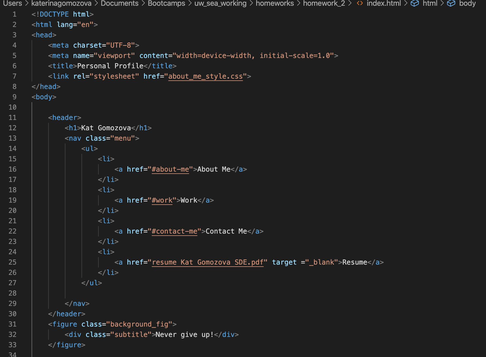
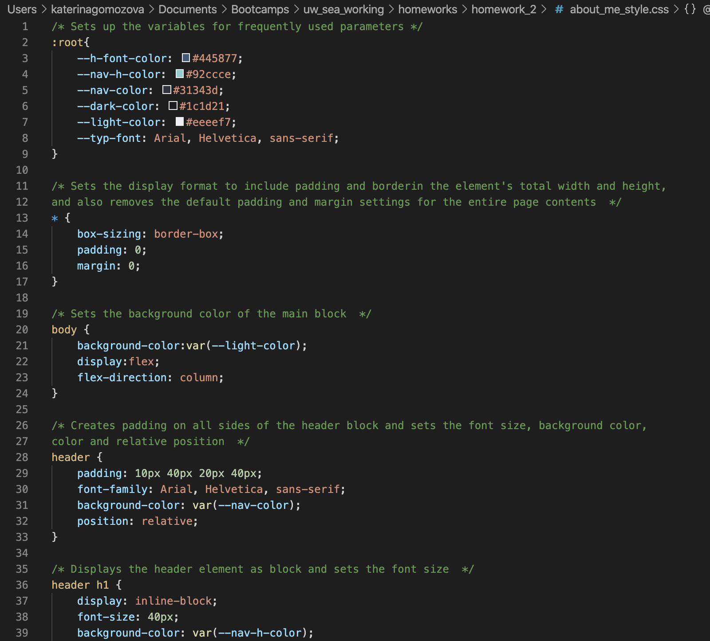
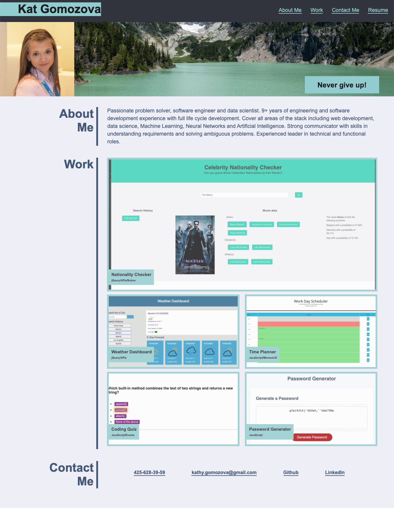

# Portfolio Profile
This repository contains portfolio of deployed web-pages. 

# Task
The goal of the task was to create a personal portfolio using flexbox, media queries, and CSS variables.
The portfolio will allow the potebtial employer to review the samples of work and assess an applicability of a candidate for an open position. 

# URL to a live page
Link to a live page: https://kgo87.github.io/portfolio_profile/  

# Structure
The folder contains  *.html* and  *.css* files and supplemental images.
## HTML code
* Perdonalized website title
* Navigation bar has links to can help to access different elements of the page
* When click on *Resume* button, the user is redirected to a page with resume
* Various semantic elements are used for better clarity
* *Github* and *LinkedIn* buttons redirects to Github and LinkedIn pages respectively.
* Screenshot of the part of the code is provided below:
               

## CSS code
* All methods include comments to describe what each method is doing
* Order of the methods match the sequence in HTML code
* Created variables for frequently used properties
* Implemented animated functionality when the user hovers to the elements
* Added functionality to display elements differently when the screen size changes
* Screenshot of the part of the code is provided below:

# Finished product
The webpage looks like this:

